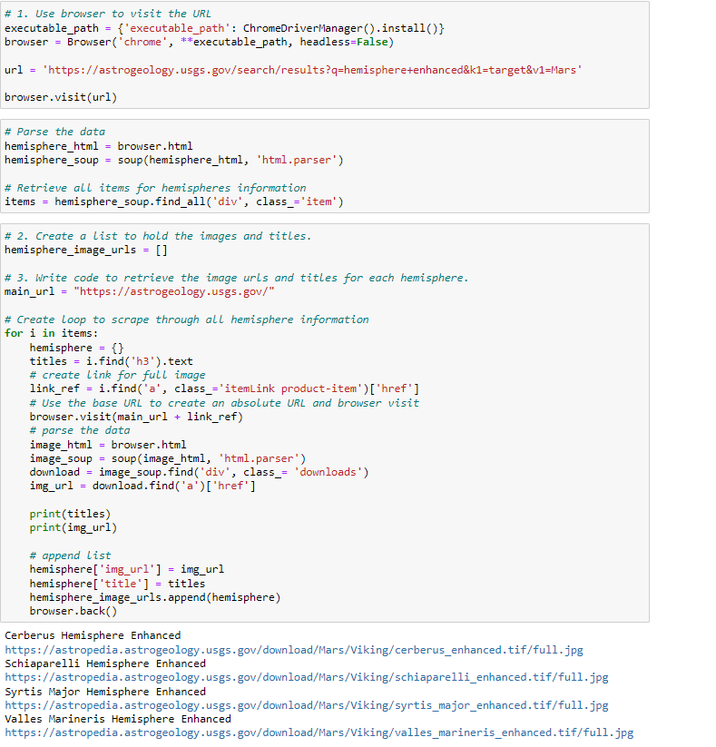
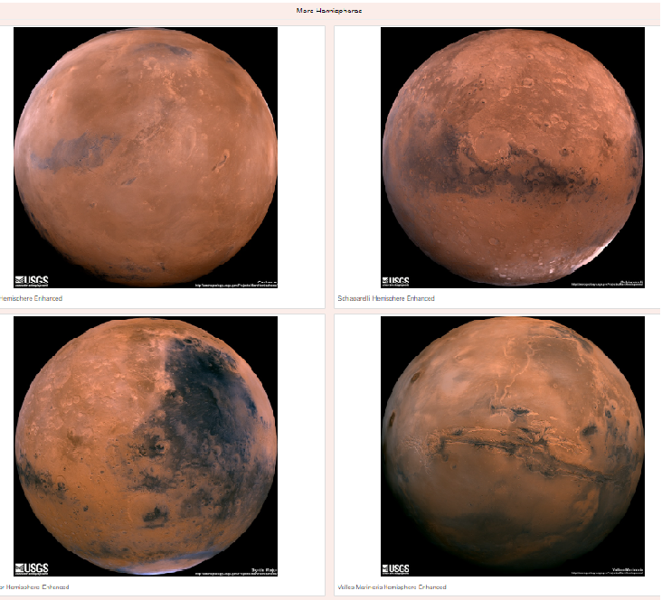

# Mission-to-Mars

# Overview of Project

The purpose of this project was to extract data from a website using Chrome Developer tools and automate the web browser to perform scraping. We then store data in a NoSQL database called MongoDB. Finally, we create a website.

### Results

Deliverable One

We used BeautifulSoup and Splinter, to scrape full-resolution images of Mars’s hemispheres and the titles of those images. Below is my code. 

Deliverable Two

We used Python and HTML to update Mongo database, and modify HTML template so the webpage contains all the information collected in the module as well as the full-resolution image and title for each hemisphere image. 

### Summary
The last part of the module was erformed by updating the website to make it mobile-responsive, and add additional Bootstrap 3 components to make it stand out.
